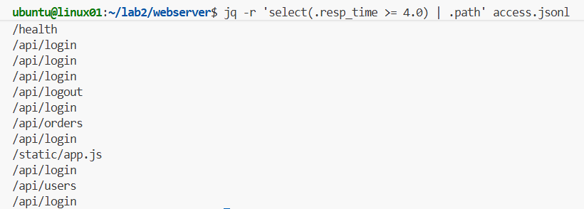
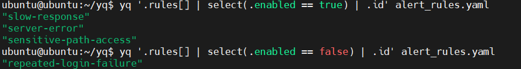
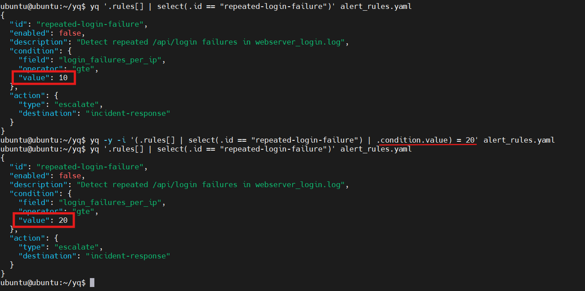

**문제 3: 응답 속도 지연 API 찾기**

## 3-1. 실습 요구사항 (병목 탐지)
SRE(사이트 신뢰성 엔지니어) 또는 백엔드 개발자로서 서버 성능 병목을 파악하기 위해, **응답 시간이 4초 이상 소요된 무거운 요청들의 엔드포인트(API URL)만 추출**해야 합니다.

## 3-2. 실습 검증
**해결 명령어:**
```bash
jq -r 'select(.resp_time >= 4.0) | .path' access.jsonl
```

**실행 결과:**



**해결 과정 상세:**

jq의 파이프라인(`|`)을 통해 데이터를 단계별로 필터링하고 가공
- **`select(.resp_time >= 4.0)`**
   - 파일에서 한 덩어리의 JSON 객체를 읽어올 때마다, 그 안의 `.resp_time` 값을 검사
   - 값이 4.0(초) 이상인 객체 데이터만 필터링하여 다음 파이프로 통과
- **`.path`**
   - 통과된 지연 로그 객체에서 우리가 알고 싶은 요청 경로(`.path`) 값만 추출
- **`r` (raw-output 옵션)**
        - 최종 출력 결과물에 씌워져 있는 큰따옴표(`""`)를 제거하여, 스크립트에서 다루기 편한 순수 텍스트 형태로 출력

---

# YQ 문제

**문제 1. 활성 규칙 식별**

## 1-1. 실습 요구사항

`alert_rules.yaml` 파일의 `rules` 배열에서 `enabled: true`인 규칙만 필터링하여 각 규칙의 `id`를 출력한다.

- 대상 파일: `alert_rules.yaml`
- 사용 도구: `yq`
- 요구 조건:
  - `rules` 배열을 순회할 것
  - `enabled == true` 조건으로 필터링할 것
  - 결과는 각 규칙의 `id`만 출력할 것

## 1-2. 실습 검증
**해결 명령어:**
```bash
yq '.rules[] | select(.enabled == true) | .id' alert_rules.yaml
```

**실행 결과:**



---


**문제 2. 특정 규칙 동적 수정**

## 2-1. 실습 요구사항 (병목 탐지)
`alert_rules.yaml` 파일에서 `id`가 `repeated-login-failure`인 규칙의 `condition.value` 값을 `10`에서 `20`으로 수정한다.

- 대상 파일: `alert_rules.yaml`
- 사용 도구: `yq`
- 요구 조건:
  - `rules` 배열에서 `id == "repeated-login-failure"`인 항목을 찾을 것
  - 해당 항목의 `condition.value`를 `20`으로 변경할 것
  - 변경 결과를 파일에 직접 반영할 것
  - 현재 실습 환경의 `yq`는 Python yq 계열이므로 `-i` 사용 시 `-y` 또는 `-Y`를 함께 사용해야 함

## 2-2. 실습 검증
**해결 명령어:**
```bash
yq -y -i '(.rules[] | select(.id == "repeated-login-failure") | .condition.value) = 20' alert_rules.yaml
```

**실행 결과:**




---
