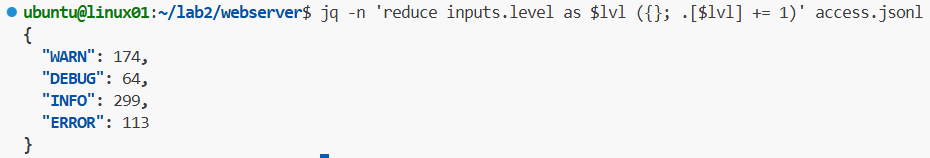

**문제 1. 타임스탬프 기준으로 30일이 지난 로그파일을 archive 폴더로 옮기기**

## 1-1. 실습 요구사항

- `~/access.json` 에서 timestamp 기준 **2026-02-17 이전 (30일 초과)** 로그만 추출
- 추출한 로그를 `~/archive/old_access.json` 으로 저장

## 1-2. 실습 검증

**해결 명령어:**

```bash
jq 'select(.timestamp < "2026-02-17")' ~/access.json > ~/archive/old_access.json
```


**실행 결과:**


**해결 과정 상세:**

jq의 파이프라인(`|`)을 통해 timestamp 값 기준으로 레코드를 필터링

- **`select(.timestamp < "2026-02-17")`**
  - 각 JSON 객체의 `.timestamp` 값을 문자열 비교로 검사
  - `2026-02-17` 이전인 객체만 필터링하여 통과
- **`> ~/archive/old_access.json`**
  - 필터링된 결과를 `old_access.json` 파일로 저장

---

## 1-3. 문제 발생 지점

`find -mtime` 은 파일의 수정시간 기준이라 파일 하나에 여러 날짜 로그가 섞여 있으면 정확하지 않다.\
로그가 JSON 형식으로 정제되어 있다면 `jq` 로 **로그 내용의 timestamp 값** 기준으로 레코드 단위로 정확하게 분리할 수 있다.

| 구분 | find -mtime (평문) | jq (JSON) |
|------|------------------|-----------|
| 기준 | 파일 수정시간 (mtime) | 로그 내용의 timestamp |
| 정확도 | touch 조작 시 오차 발생 | 내용 기준이라 정확 |
| 혼합 로그 | 파일 단위라 분리 불가 | 레코드 단위로 정확히 분리 |

---

**문제 2: 로그 레벨 문제**
## 2-1. 실습 요구사항
- `awk`로 로그 레벨을 추출하는 문제 풀이가 불필요하게 길고 복잡하다는 문제점이 있었다. \
- JSON파일 형태로 만들어진 로그 파일을 활용해 `jq`로 더욱 간단하게 스크릅트를 작성해 본다.

## 2-2. 실습 검증
#### a. 해결 명령어
```bash
jq -n 'reduce inputs.level as $lvl ({}; .[$lvl] += 1)' access.json
```
#### b. jq 스크립트 핵심 원리

1. **`n` (Null input 옵션)과 `inputs`**
    - `n`: `jq`가 파일을 한 번에 통째로 읽어들이지 않도록 제어
    - `inputs`: `.json` 파일의 객체들을 하나씩 차례대로 스트리밍하여 읽음. (수 기가바이트의 대용량 로그를 처리할 때 메모리 폭발을 막아주는 핵심 기능)
2. **`reduce ... as $lvl ({초기값}; 업데이트 로직)`**
    - 스트리밍되는 각 로그 객체의 `.level` 값을 추출하여 `$lvl` 이라는 임시 변수에 담고 반복문 실행.
3. **`{}` (초기 상태)**
    - 결과를 저장할 빈 JSON 객체(`{}`)를 초기값으로 생성
4. **`.[$lvl] += 1` (카운팅 로직)**
    - 방금 읽어온 레벨 이름(`$lvl`)을 키(Key)로 삼아 값을 1씩 증가
    - ex: 처음 `WARN`을 만나면 `{"WARN": 1}`이 되고, 다음에 또 `WARN`을 만나면 `{"WARN": 2}`로 누적

#### c. 실행 결과



**문제 3: 응답 속도 지연 API 찾기**

## 3-1. 실습 요구사항 (병목 탐지)
SRE(사이트 신뢰성 엔지니어) 또는 백엔드 개발자로서 서버 성능 병목을 파악하기 위해, **응답 시간이 4초 이상 소요된 무거운 요청들의 엔드포인트(API URL)만 추출**해야 합니다.

## 3-2. 실습 검증
**해결 명령어:**
```bash
jq -r 'select(.resp_time >= 4.0) | .path' access.jsonl
```

**실행 결과:**


**해결 과정 상세:**

jq의 파이프라인(`|`)을 통해 데이터를 단계별로 필터링하고 가공
- **`select(.resp_time >= 4.0)`**
   - 파일에서 한 덩어리의 JSON 객체를 읽어올 때마다, 그 안의 `.resp_time` 값을 검사
   - 값이 4.0(초) 이상인 객체 데이터만 필터링하여 다음 파이프로 통과
- **`.path`**
   - 통과된 지연 로그 객체에서 우리가 알고 싶은 요청 경로(`.path`) 값만 추출
- **`r` (raw-output 옵션)**
        - 최종 출력 결과물에 씌워져 있는 큰따옴표(`""`)를 제거하여, 스크립트에서 다루기 편한 순수 텍스트 형태로 출력

---

# YQ 문제

**문제 1. 활성 규칙 식별**

## 1-1. 실습 요구사항

`alert_rules.yaml` 파일의 `rules` 배열에서 `enabled: true`인 규칙만 필터링하여 각 규칙의 `id`를 출력한다.

- 대상 파일: `alert_rules.yaml`
- 사용 도구: `yq`
- 요구 조건:
  - `rules` 배열을 순회할 것
  - `enabled == true` 조건으로 필터링할 것
  - 결과는 각 규칙의 `id`만 출력할 것

## 1-2. 실습 검증
**해결 명령어:**
```bash
yq '.rules[] | select(.enabled == true) | .id' alert_rules.yaml
```

**실행 결과:**


---


**문제 2. 특정 규칙 동적 수정**

## 2-1. 실습 요구사항 (병목 탐지)
`alert_rules.yaml` 파일에서 `id`가 `repeated-login-failure`인 규칙의 `condition.value` 값을 `10`에서 `20`으로 수정한다.

- 대상 파일: `alert_rules.yaml`
- 사용 도구: `yq`
- 요구 조건:
  - `rules` 배열에서 `id == "repeated-login-failure"`인 항목을 찾을 것
  - 해당 항목의 `condition.value`를 `20`으로 변경할 것
  - 변경 결과를 파일에 직접 반영할 것
  - 현재 실습 환경의 `yq`는 Python yq 계열이므로 `-i` 사용 시 `-y` 또는 `-Y`를 함께 사용해야 함

## 2-2. 실습 검증
**해결 명령어:**
```bash
yq -y -i '(.rules[] | select(.id == "repeated-login-failure") | .condition.value) = 20' alert_rules.yaml
```

**실행 결과:**


---
